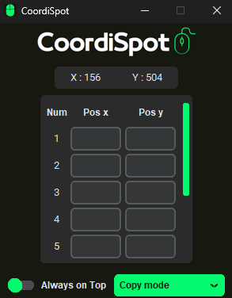
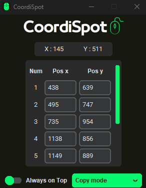
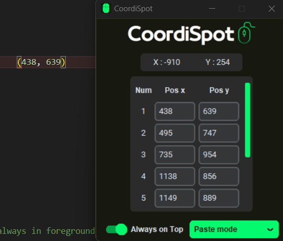

# CoordiSpot

CoordiSpot is a simple desktop application that allows you to quickly capture and copy mouse coordinates to use in your projects. It provides a user-friendly interface to display the current mouse position and offers convenient options for copying coordinates.

## Features

- Real-time display of mouse coordinates (X and Y) on the application interface.
- Copy mode: Assign hotkeys to copy the current mouse coordinates to predefined entry fields.
- Paste mode: Assign hotkeys to automatically paste the copied coordinates from the selected entry field.
- In the Paste Mode, the coordinates will be pasted in a tuple, ex: (578, 26), for facilities the usage.

## Screenshots

### Copy Mode:



### Paste Mode:


## Installation

1. Clone the repository:

   ```shell
   git clone https://github.com/claudioaguiarg/CoordiSpot

2. Clone the repository:

   ```shell
   pip install -r requirements.txt

3. Run the application:
    ```shell
   python main.py

## Usage
The CoordiSpot is indicated to Python Automation Programmers but doesn't have any contraindications.

- Launch the CoordiSpot application.
- The X and Y coordinates of the mouse will be displayed in real-time on the interface.
- Choose the desired mode (Copy mode or Paste mode) from the options menu.
- Copy Mode: Use the numbers 1 to 9 to copy the current coordinates to the specific field in the app.
- Paste Mode: Use the NumPad 1 to 9 to paste the respective coordinates in anywhere. (Recommended use of CTRL + Numpad to don't write the respective number with the coordinates that will be pasted)

## Contributing
Contributions are welcome! If you encounter any issues or have suggestions for improvements, please open an issue or submit a pull request.

## License
This project is licensed under the MIT License. You can find more information in the LICENSE file.
